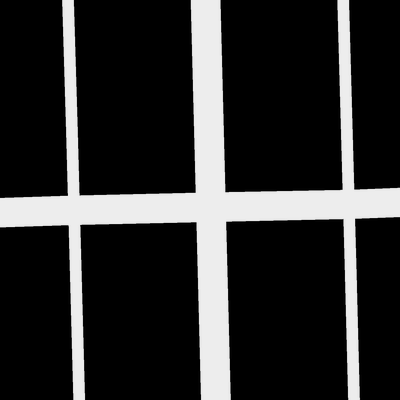
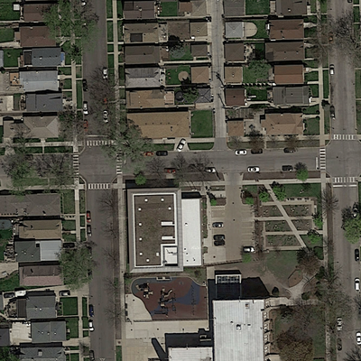
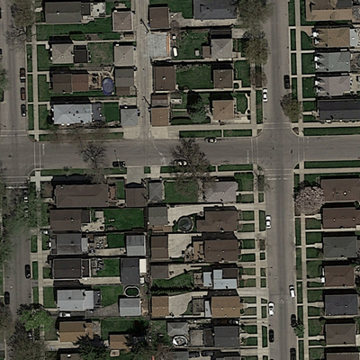

# 🛰️ UNet-Based Satellite Image Segmentation

This project implements a UNet model using PyTorch for segmenting satellite images. The model is trained on paired image-mask samples and deployed using a Gradio interface via Hugging Face Spaces.

## 🌐 Live Demo

👉 [Check out the app on Hugging Face Spaces](https://huggingface.co/spaces/baidyasubha/Road-Segmentation) 

---

## 📁 Files in This Repository

- `app.py`: Gradio app to run inference using the trained UNet model.
- `train.py`: Script to train the UNet model on image-mask pairs.
- `model.py`: PyTorch implementation of the UNet architecture.
- `dataset.py`: Custom dataset loader for segmentation data.
- `requirements.txt`: Python dependencies for running the app.

---
## 🔍 Sample training datas

Here are some examples from the training set showing input images, ground truth masks.

| Satellite Image | Ground Truth Mask |
|-----------------|-------------------|
|  |  |
|  |  |
|  |  |

